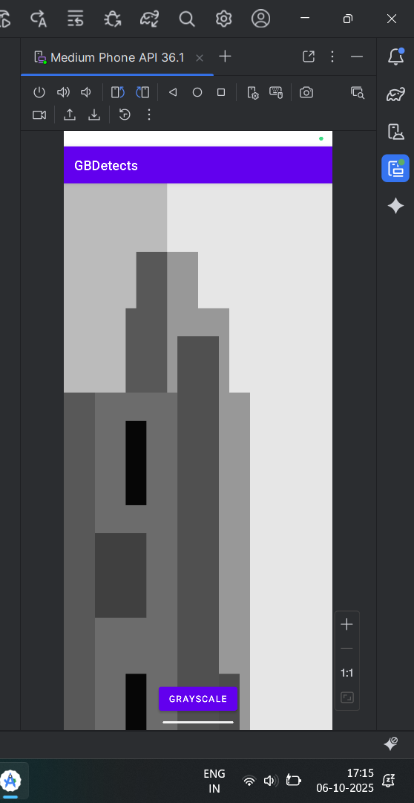

# GBdetects
A high-performance Android application that uses the device camera to perform real-time computer vision tasks. The app processes the video stream natively with C++ and OpenCV, rendering the output via OpenGL ES for maximum efficiency.

✨ Key Features
--------------

*   **Live Camera Processing**: Captures video using the Camera2 API for direct, low-level frame access.
    
*   **Native C++ Performance**: All image processing is offloaded to the NDK layer using C++ for speed, communicating with Java via a JNI bridge.
    
*   **OpenCV Integration**: Leverages the powerful OpenCV library for core computer vision algorithms.
    
*   **Efficient OpenGL Rendering**: Renders the processed video stream as a texture using OpenGL ES 2.0, ensuring a smooth, real-time display.
    
*   **Web-Based Viewer**: Includes a simple TypeScript web component to demonstrate displaying processed output outside the native app.
    

### 🌟 Bonus Features Implemented

*   **Multi-Mode Processing**: A toggle button on the UI allows switching the live feed between three modes:
    
    1.  **Raw Camera Feed** (Color)
        
    2.  **Canny Edge Detection**
        
    3.  **Grayscale**
        
*   **Performance Monitoring**: A real-time FPS (Frames Per Second) counter logs the rendering performance to Logcat, helping to diagnose and verify system smoothness.
    
## 🛠️ Tech Stack

| Component                  | Technologies Used               |
|--------------------------|-------------------------|
| **Android App** | **Java, Android SDK, NDK (C++), JNI** | 
| **Computer Vision**       | **OpenCV 4.x**        | 
| **Graphics**     | **OpenGL ES 2.0** |
| **Web Viewer**     | **TypeScript, HTML5** |

🏗️ System Architecture

The application is designed to minimize latency by keeping heavy computations on a background thread and within the native C++ layer.

Data Flow: Camera2 (Java) → ImageReader (Java) → JNI Bridge → C++ Layer → OpenCV (Processing) → OpenGL ES (Rendering) → GLSurfaceView (Display)

1.  **Capture**: CameraDevice provides frames to an ImageReader on a background thread.
    
2.  **JNI Bridge**: Raw frame data (ByteBuffer) is passed to the native C++ function.
    
3.  **Process**: OpenCV in C++ applies the selected filter (Edges, Grayscale, etc.).
    
4.  **Render**: The processed cv::Mat is converted to a ByteBuffer and passed back to Java, where it's uploaded to an OpenGL texture and drawn on screen.

## 📷 Screenshots & Output

Below are sample results and logs from the running app:

- FPS logs showing live rendering from OpenGL
- Toggle feature between **Raw**, **Grayscale**, and **Edge-detected** views

## 📷 Screenshots & Output

| FPS Logging (real-time) | Edge Detection | Grayscale Output | Web Viewer Page |
|:------------------------:|:---------------:|:----------------:|:----------------:|
|  |  |  |  |


🚀 Getting Started
------------------

### Prerequisites

*   Android Studio (latest version)
    
*   Android NDK and CMake (installable via SDK Manager)
    
*   OpenCV for Android SDK (download from [opencv.org](https://opencv.org/releases/))
    

### Installation & Build

1.  ```git clone https://github.com/Ganeshiiitdwd/gbdetects```
    
2.  **Import the OpenCV Module:**
    
    *   Extract the downloaded OpenCV Android SDK.
        
    *   In Android Studio, select File > New > Import Module....
        
    *   Navigate to and select the /sdk folder from the extracted OpenCV package.
        
    *   Accept the default module name (sdk or rename it to opencv).
        
3.  **Link the Module:**
    
    *   Right-click the app module and go to Module Settings > Dependencies.
        
    *   Click + and add a Module Dependency on the newly imported OpenCV module.
        
4.  **Sync and Run:**
    
    *   Let Gradle sync the project. The ```CMakeLists.txt``` is pre-configured to find the OpenCV library.
        
    *   Build and run the application on an Android emulator or physical device.
        

### Web Viewer

1.  Navigate to the /web directory.
    
2.  Install dependencies: npm install (if any were added).
    
3.  Compile TypeScript: tsc.
    
4.  Open index.html in a web browser to see the static sample.
